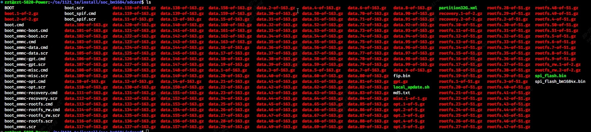
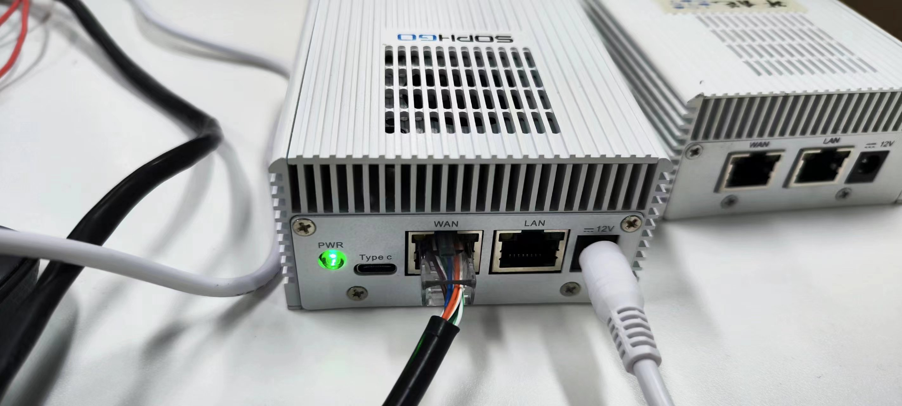
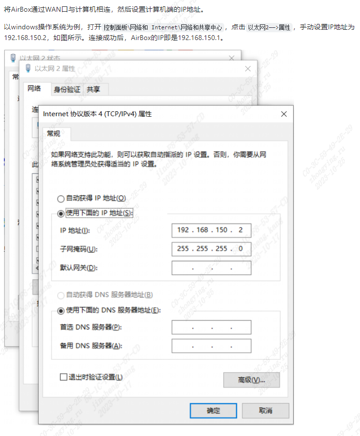

# Airbox大模型演示

*zhongying.ru@sophgo.com*

## 安装、部署操作

1. 如果是原厂发来的裸机，需要刷机；若不是裸机，跳过这步。

    刷机步骤：
    1. 准备一张不小于32GB的sd卡和一个读卡器。[下载刷机包](https://pan.baidu.com/s/1gQO6b0WRPfxua3rYkcxwHA?pwd=swje)。
    下载完成后解压缩，将如图这些文件（BOOT等等）直接复制到sd卡的根目录下。
    2. 将sd卡插在盒子的micro sd口；连接电源线，按PWR到绿灯亮起再松开；等待30分钟。到时间后，断电。

2. 连接电源线，按PWR到绿灯亮起再松开，听到风扇声音就是启动好了。
3. 如图连接网线。如果是首次使用网线连接盒子和电脑，需要修改本机ip为`192.168.150.2`。
4. 打开terminal，输入`ssh linaro@192.168.150.1`，
密码`linaro`。

5. 风扇太吵的话输入

   ```sh
   sudo busybox devmem 0x50029000 32 0x500
   sudo busybox devmem 0x50029004 32 0xfa0
   ```

## BM1684X大模型能力展示


1. TTS文本转语音([code](https://github.com/ZillaRU/EmotiVoice-TPU))

   - 支持千种音色
   - 多样化情感
   - 中英文
   - 生成120s语音仅需3s
   - `cd /data/EmotiVoice-TPU && python3 demo-page.py`
2. 文生图、图生图
   - SD v1.5、v2.1([code](https://github.com/forechoandlook/aigc))
   - SD XL([code](https://github.com/ZillaRU/SDXL-tpu))
   - LCM加速，单芯<2s出图，双芯加速更快 `cd /data/lcm && bash run.sh`
   - 出图可控性：ControlNet、Lora等增强出图可控性的扩展也有适配
   - 图生图-->语义超分

3. 文搜图，图搜图([code](https://github.com/ZillaRU/ImageSearch-tpu))

   - 非打标签，自然语言描述
   - 亿图秒搜（多模态大模型 + 向量数据库）
   - `cd /data/ImageSearch-tpu && steamlit run app.py CH/EN`
4. 文 / 图 搜视频([code](https://github.com/ZillaRU/VideoSearch-tpu))

   - 自然语言描述
   - 精准定位
   - 场景切分+多模态大模型+向量数据库
   - `cd /data/VideoSearch-tpu`

5. ChatDoc私域知识管理([code](https://github.com/zhengorange/chatdoc))
   - **通用知识+私域知识** 问答、chatbot聊天交互
   - LLM模型基座 + langchain + 文本向量化 + 向量数据库
   - 已适配基座：通义千问7B（[code](https://github.com/sophgo/Qwen-TPU)）、llama-7B、chatglm2-6B
   - `cd /data/chatdoc && bash run_emb_tpu.sh`

6. 图像/视频的语义分割([code](https://github.com/ZillaRU/AnnoSeg))

   - 基于提示的任意物体分割
   - **像素级标注**: 结合检测模型（YOLO / GroundingDINO）

7. 超分辨率

    - 图像超分、视频超分
8. 数字人([code](https://github.com/ZillaRU/SadTalker-tpu))

   - 一张人像 + 文本 = talking video
9.  CASAOS开源家庭云系统

10. Whisper音频转文字([code](https://github.com/JKay0327/whisper-TPU_py))

    - 多语言识别、转录
    - -- +LLM ->：会议纪要


## 开源工具链支持

使用[TPU-MLIR](https://tpumlir.org/)算能的开源工具链，可自己完成

- **模型转换**：caffe、torch、onnx等格式模型转换为芯片支持的bmodel格式
- FP16、int8等精度的**量化加速和校准**
- **加算子**
  
提供[快速入门文档](https://tpumlir.org/docs/quick_start/index.html)、[开发手册](https://tpumlir.org/docs/developer_manual/index.html)和[视频教程](https://tpumlir.org/docs/videos.html)。
